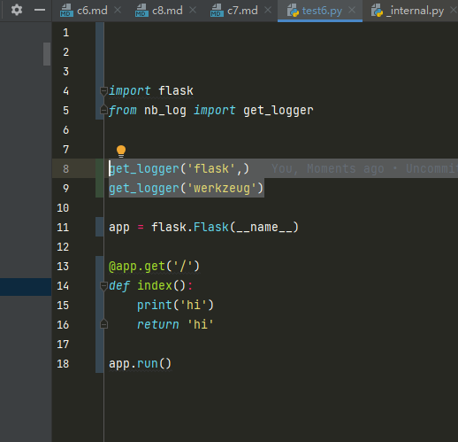
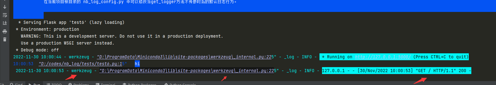
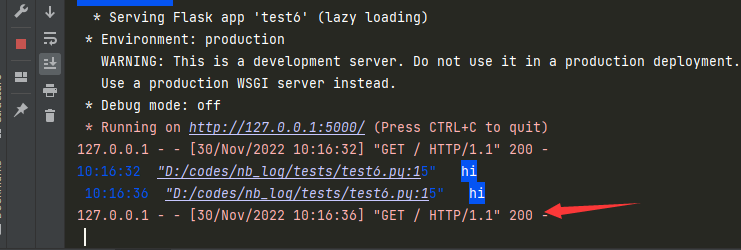
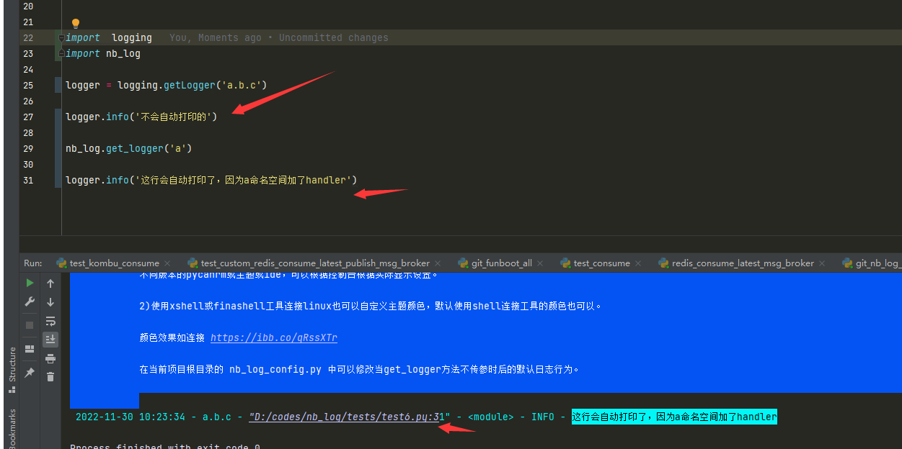
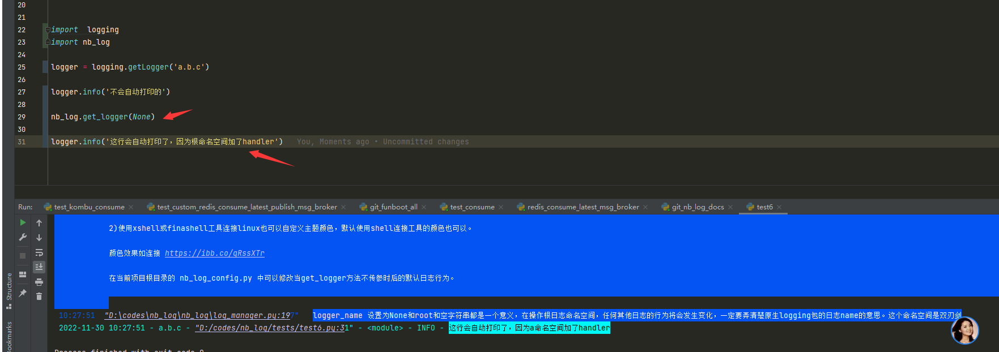

# 7 nb_log 捕获三方包的日志

准确来说不是捕获，是给三方包的logger加上handlers，三方包的logger没有观察者例如 streamHandler fileHanlder等，不会自动打印控制台和记录文件啥的。

## 7.1 nb_log 记录三方包日志的方法，requests举例子

一般三方包的每个模块都会写 logger = logging.getLogger(__name__)，很多人非常之蒙蔽对这句话。

这个是创建了当前 包名.文件夹名.模块名 的日志命名空间,但没有创建handler，所以里面 logger.info() 是不会被记录到的。

只有对这个命名空间的logger加上handlers后才会记录到各种地方。


```python
from nb_log import get_logger
import requests

get_logger('urllib3')  # 也可以更精确只捕获 urllib3.connectionpool 的日志，不要urllib3包其他模块文件的日志
requests.get("http://www.baidu.com")
```


<a href="https://imgtu.com/i/hJbkrD"></a>
 


有的人要记录请求了什么，状态是什么，非要自己亲自写日志，那其实urllib3对每个请求和状态码都记录了，
并不需要用户去亲自再重复写logger.info("请求了什么url  耗时多少 状态码是什么")，这些都是多此一举，主要是用户不懂日志命名空间。
如上图，get_logger 对 urllib3 命名空间的日志加上了控制台handler后就会自动记录到请求了什么url和响应情况了，完全不需要用户修复写代码。

requests包会调用urllib3,urllib3包里面记录了日志请求什么了，所以上面是 get_logger('urllib3') 而不是 get_logger('requests'),
一般情况下 get_logger(name=三方包名就可以了)

## 7.2 nb_log还可以记录flask/django任意三方包

例如 get_logger(name="werkzeug",log_file_name='myfile.log') ,就会记录到请求flask服务端url的日志到控制台和myfile.log了。

一般情况下 get_logger(name=三方包名就可以了)，get_logger(name='flask') 就可以记录到前端请求的是什么url了，
但是flask是一个基于Python开发并且依赖jinja2模板和Werkzeug WSGI服务的一个微型框架,对于Werkzeug本质是Socket服务端,
其用于接收http请求并对请求进行预处理，所以 get_logger(name="werkzeug") 用于捕获日志，因为记录请求url的是在 werkzeug 包下面写的，
所以命名空间是 werkzeug.xx.yy 。





如果代码中不写  get_logger(name="werkzeug")



## 7.3 python日志命名空间是树形结构

假设三方包名是 thp，三方包根目录里面有 xx.py 和 yy.py，并且每个python文件是 logger = logging.getLogger(__name__) 的，
你如果想捕获thp包所有日志， get_logger('thp') 就好了。

如果你只想捕获 xx.py的debug以上日志， 捕获yy.py的error以上日志，那么应该写 
get_logger('thp.xx',log_level_int=10)  # 10就是 logging.DEBUG常量。
get_logger('thp.yy',log_level_int=40)  # 40就是 logging.ERROR常量。
 

python的日志命名空间是树形的，用 . 隔开。

假设 日志命名空间是 a.b.c, 那么 a 和a.b  和 a.b.c 都可以捕获 a.b.c 命名空间日志。


例如这个例子，第27行并不会被打印，但是第31行可以打印出来日志。因为a命名空间是a.b.c的父命名空间，a.b.c会先查找 a.b.c，再查找 a.b，再查找a，再查找根命名空间,一直向上查找。

根命名空间是所有一切命名空间的父命名空间。

1）这是给a命名空间加上handlers




2） 当name传 None时候意思是根命名空间加上handlers了。根命名空间是无敌的，会捕获所有三方包的日志，如果你不想捕获所有包的日志就别这么用。




<div> </div>