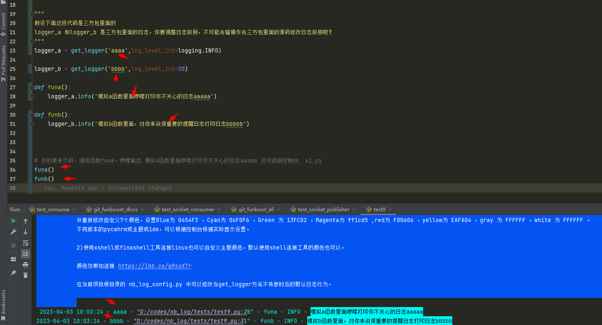
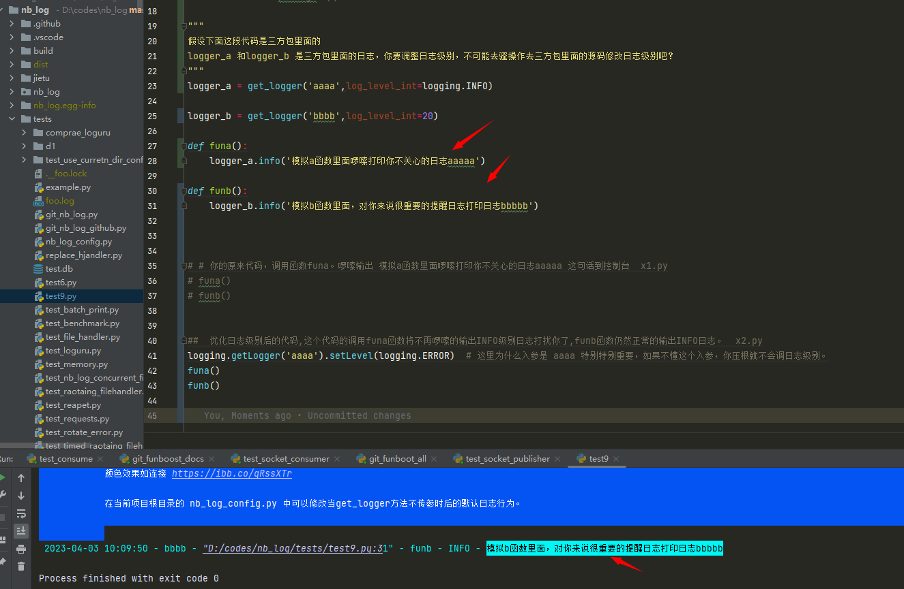
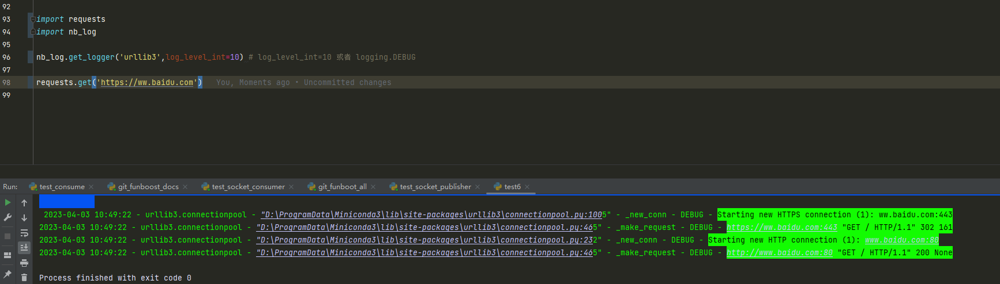
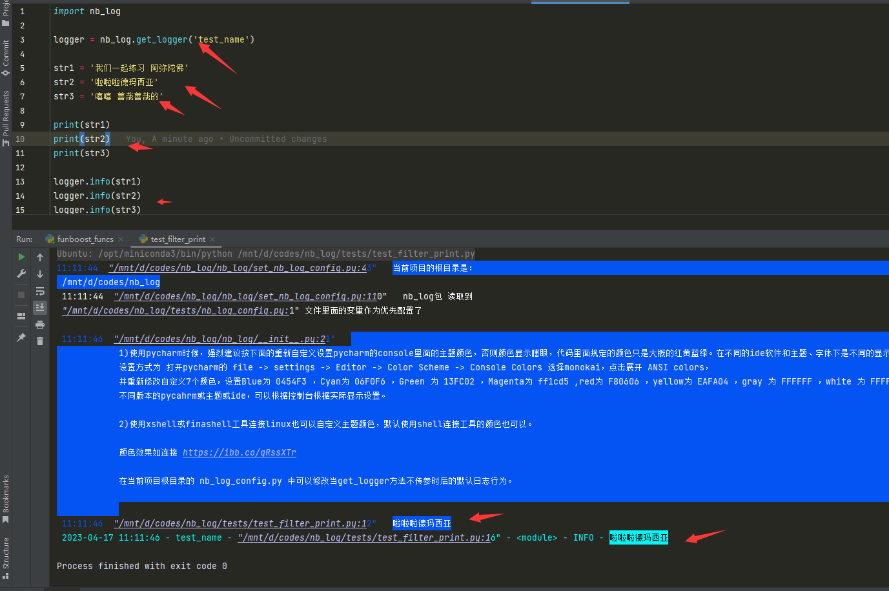

# 9 nb_log常见疑问解答

## 9.1 怎么把普通debug info日志写入文件a，把错误级别日志写到文件b？

看文档 1.1.a2 介绍


## 9.2 没有使用pycahrm run运行，直接在linux或cmd运行，生成的nb_log_config.py 位置错误，或者导入不了nb_log_config模块


1.1.c中已经说明了：

项目中任意脚本使用nb_log,第一次运行代码时候，会自动在 sys.path[1] 目录下创建 nb_log_config.py文件并写入默认值。
之后nb_log 会自动 import nb_log_config, 如果import到这个模块了，控制台会提示读取了什么文件作为配置文件。

如果是 cmd或者linux运行不是pycharm，需要 设置 PYTHONPATH为项目根目录，这样就能自动在当前项目根目录下生成或者找到 nb_log_config.py了。

用户可以print(sys.path)  print(sys.path[1]) 来查看 sys.path[1]的值是什么就知道了。

连PYTHONPATH作用是什么都不知道的python小白，一定要看下面文章 。

[pythonpath作用介绍的文章](https://github.com/ydf0509/pythonpathdemo)


说明完全不看文档，到现在还不知道PYTHONPATH的python人员太懒惰low了，文章说了很多次掌握PYTHONPATH的用途和好处了。


## 9.4 pyinstaller 打包后运行报错，no such file nb_log_config_default.py


如上图报错，

是因为导入不了 nb_log_config 模块，因为nb_log包是动态 importlib('nb_log_config')的，所以不能检测到需要打包nb_log_config.py

需要在pyinstaller打包时候生成的spec文件中去定义 hiddenimports 的值， hiddenimports=['nb_log_config'] ，
这样就会打包包括nb_log_config.py了，不会去自动新建配置文件了。


pyinstaller 使用spec文件来打包exe。  pyinstaller xxxx.spec 就可以了。

百度吧，连pyinstaller的spec文件的意义是什么都不知道就非要去打包，要先学习pystaller用法。


### 9.4.2 打包报错 no such file nb_log_config_default.py，解决方式2

只要在你的代码中写上 import nb_log_config ，那么打包就会自动包括了，这样就不需要在spec文件中去定义 hiddenimports 的值了。

<div> </div>

## 9.5 怎么屏蔽和打开某一部分日志？（选择性关闭和打开某部分日志）

不懂日志命名空间的是不可能精通怎么设置日志级别的。

<pre style="font-size: large;color: greenyellow;background-color: #0c1119">
有的人真的很头疼，老是问这种基础的低级问题，比如funboost的日志级别如何调，如何做到希望显示某个函数/模块的debug打印，但却又要关闭另一个模块/函数的info打印？
任何python日志只要是logging包实现的，日志就可以设置不显示和设置打开。

老是问这种问题，主要是不懂日志命名空间基本概念，尽管文档已经重复了不下50次这个名词，还是再在解答章节统一再啰嗦一次,说了无数次这个logging.getLogger第一个入参的意义，这就是文档长的原因。

这个问题从最基本的日志树形命名空间说起必须，不去了解日志name入参作用的人，永远搞不懂怎么关闭和打开特定日志，也不可能从根本性知道为什么不用print而要用日志。
</pre>

<pre style="font-size: large;color: #FFFF66;background-color: #0c1119">
在文档 1.6和 1.9 中就已经说明了， nb_log.get_logger  以及官方内置的 logging.getLogger 函数的第一个入参的name作用和意义了，
第一个入参作用是什么，这是python官方日志的重要特性，包括java语言的日志也是这样的，
如果连日志的name是什么都完全不知道，那就别说自己会使用日志了，请不要使用日志了，干脆自己封装个函数里面print和file.write算了，不懂name的作用的情况下使用日志毫无意义，不如print到底算了。
日志命名空间是python官方日志以及任何语言的最基本作用。

在nb_log文档中搜索 命名空间，会有很多讲解日志命名空间作用的，有的人嫌弃文档长，主要是花了很大篇幅讲解日志命名空间，这是官方日志的基本知识，
主要是有的人完全不懂官方内置日志的logging.getLogger(name) 入参的意义，所以造成文档长。
因为 nb_log使用的是官方logging实现的，于第三方包和各种扩展兼容性无敌， nb_log.get_logger 和 logging.getLogger 函数返回的都是原生logging.Logger对象，
所以兼容性无敌，这一点上远远的暴击loguru这种独立实现的logger对象。

</pre>


### 9.5.1 真实代码例子，说明怎么屏蔽某个日志。


假设下面这段代码是三方包里面的

logger_a 和logger_b 是三方包里面的日志，你要调整日志级别，不可能去骚操作去三方包里面的源码修改日志级别吧？

三方包里面的代码，packege1.py


```python
import logging
from nb_log import get_logger

"""
logging.DEBUG 是个常量枚举，值是10
logging.INFO 是个常量枚举，值是20
logging.WARNING 是个常量枚举，值是30
logging.ERROR 是个常量枚举，值是40
logging.CRITICAL 是个常量枚举，值是50

用数字和常量枚举都可以。
"""


logger_a = get_logger('aaaa',log_level_int=logging.INFO)

logger_b = get_logger('bbbb',log_level_int=20)

def funa():
    logger_a.info('模拟a函数里面啰嗦打印你不关心的日志aaaaa')

def funb():
    logger_b.info('模拟b函数里面，对你来说很重要的提醒日志打印日志bbbbb')
```


你的原来代码，调用函数funa。啰嗦输出 模拟a函数里面啰嗦打印你不关心的日志aaaaa 这句话到控制台  x1.py

```python
import funa,funb
funa()
funb()
```



优化日志级别后的代码,这个代码的调用funa函数将不再啰嗦的输出INFO级别日志打扰你了,funb函数仍然正常的输出INFO日志。  x2.py

```python
import funa,funb
logging.getLogger('aaaa').setLevel(logging.ERROR)  # 这里为什么入参是 aaaa 特别特别重要，如果不懂这个入参，你压根就不会调日志级别。
funa()
funb()
```



```
可以看到日志是灵活的，非常方便的关闭和打开日志，如果三方包在源码里面使用的是print，请问你如何打开或屏蔽某段打印？
还有就是日志命名空间了，有的人压根不懂日志命名空间，为什么我这个例子可以实现 打印funb里面的INFO日志，而关闭funa里面的INFO日志，希望你好好想明白。

为什么是 logging.getLogger('aaaa').setLevel(logging.ERROR)，
如果你是写的代码是 logging.getLogger('cccc').setLevel(logging.ERROR) 会屏蔽funa里面的INFO日志吗？自己好好想想。

```

### 9.5.2 你如何知道日志的命名空间 (name) 是什么?

```
你需要点击到源码去看日志的 getLogger 的name入参是什么吗，答案是否定的。
例如9.5.1 ，你是如何知道要写 logging.getLogger('aaaa').setLevel(logging.ERROR)，
你要咋知道 写 aaaa 而不是其他？ 这个在运行结果截图中已经显示了，nb_log的大部分日志模板的时间后面的 - xxxx - 就是指的日志name。

总结下如何知道日志的name的

1、看源码，看生成logger对象的地方的第一个入参
2、看控制台的日志模板
3、对那个logger.info的logger对象，加个print(logger.name),你就知道他的name了

```

### 9.5.3 经常看到三方包中写 logger = logging.getLogger(\__name\__) 啥意思？这个logger对象的name命名空间是什么？

```
logger = logging.getLogger(__name__) 是非常非常常见的写法，三方包里面大多数是这样，用户自己写的项目代码最好也可以是这样，这个好处非常多，
这种日志命名空间，一看就知道是什么文件夹下的什么python文件下的日志。
```

假设三方包 package1 的目录如下：
```
package1
     dir2
        module3.py


在 module3.py 源码中写 logger = logging.getLogger(__name__)，
此时logger对象还没有添加各种handlers，所以info及以下级别的日志默认就是不会显示的，如果已经添加了handlers后，就会显示日志了。

那么你要如何屏蔽或者捕获日志呢，主要还是要知道命名空间，因为源码写入参的是 __name__，所以你是不是不知道他的命名空间是什么了，这个也是python基础，

你只要 logging.getLogger('package1.dir2.module3').setLevel(logging.ERROR) 就能调高module3.py中的日志界别了。
你也可以 logging.getLogger('package1.dir2').setLevel(logging.ERROR)，这是调高 package1/dir2文件夹下所有python文件的日志级别。
你也可以 logging.getLogger('package1').setLevel(logging.ERROR)，这是调高 package1包里面的一切python文件的日志级别。
日志命名空间是树形的，假设 a.b.c ，那么a.b.c 和 a.b 和 a 都可以 对他设置命名空间和添加handlers。

因为 __name__ 在自己当前运行模块的值是 "__main__",
如果某个模块被其他地方导入，作为被导入模块，在其他地方看来，他的  __name_ 就是 把文件夹路径名的 / 换成. ,然后去掉.py。这是python基本常识。

```

### 9.5.4 日志命名空间是树形的
```
logger的name如果是 a.b.c， 只要你在a.b加上handler 或者a上加上handlers，a.b.c的日志就可以被记录。
因为日志命名空间使用 . 分割 a.b是a.b.c的父命名空间，a是a.b的的父命名空间。

如果你想 a.b.d 显示debug以上日志，a.b.c 显示info以上日志 ，那就需要精细化设置 a.b.d 和a.b.c的日志为不同级别了，不能只设置a.b，那就没法区分这两个命名空间的日志级别了。

现在知道 logger = logging.getLogger(__name__) 了吧， __name__ 是天然的树形日志命名空间。 
例如celery三方包的 celery/worker/consumer/connection.py 里面如果写 logger = logging.getLogger(__name__)， 那么日志命名空间就自动是  celery.worker.consumer.connection 了，这就是一个树形命名空间了。
粗暴一点 getLogger("celery") 对 celery整体设置日志级别，也可以 getLogger('celery.worker.consumer.connection') 精细化对celery每个不同的模块设置为不同的日志级别
```


### 9.5.5 举个例子，如何打开某个日志显示(和屏蔽日志相反)

requests请求百度，requests使用的是urllib3封装的，urllib3中已经有日志已经记录了请求状态码和url了。只需要给urllib3添加handlers就行了。

```
nb_log.get_logger(name)是对应原生logging包的，
logger=logging.getLogger(anme)
handler = xxHandler()  
formatter = Formatter()
handler.setFormatter(formatter)  
logger.addHnalder(handler) 的全流程封装。  

不懂日志的人，还需要自己封装搞个请求函数，在请求函数里面加日志，自己去手写记录请求了什么rul 响应状态码是什么，那是你不懂日志和命名空间，所以你需要脱了裤子放屁。
```



```
从日志可以看到，记录请求url和状态码的日志命名空间是 urllib3.connectionpool, 但是上面9.5.4讲了，日志命名空间是树形的，
所以你只需要对 urllib3 设置debug级别，并加上handlers后， urllib3.connectionpool 命名空间的debug级别 以上就可以被记录到了。
```

### 9.5.6 nb_log 提前锁定日志级别的方式

有的日志 logger对象 是随着 类实例化时候动态创建的，不方便去修改日志级别。 
因为有的日志是动态的在函数或者内里面去创建logger和设置日志级别。如果你提前设置日志级别，还是会被动态调用时候生成的logger的日志级别覆盖掉，

nb_log提供了提前锁定日志级别的方法，nb_log通过猴子补丁patch了 logging.Logger.setLevel方法，

使用 nb_log.LogManager('name1').preset_log_level(20) 可以给某个命名空间提前锁定日志级别，锁定日志级别后，后续再修改他的级别会使设置无效。

nb_log.LogManager('name1').preset_log_level(20) 比官方自带的设置日志级别方法 setLevel  的 nb_log.LogManager('name1').setLevel(20) 更强力，
preset_log_level是锁定日志级别，后续无法再对name1命名空间修改日志级别；而setLevel 设置日志级别后，后续还可以修改日志级别。


代码例子：

```python

import logging
import nb_log

nb_log.LogManager('name1').preset_log_level(20)  # preset_log_level 提前设置锁定日志级别为20(logging.INFO)

logger = nb_log.get_logger('name1',log_level_int=logging.DEBUG) # 设置级别为debug操作失效
# logger.setLevel(10) # 设置级别为debug操作失效
logger.debug('啊啊啊')  # 由于已经提前锁定了日志级别为INFO，后续再修改级别为DEBUG无效，所以这个logger.debug日志不会显示。
```

### 9.5.7 print或logger消息中包括某些字符串，屏蔽打印的设置

```
在 nb_log_config.py 配置文件中的FILTER_WORDS_PRINT 填写  FILTER_WORDS_PRINT = ["测试过滤字符串的呀", "阿弥陀佛", "善哉善哉"]，那么消息中包含数组中任何一个字符串，消息将不会打印出来。
以下为例子。
```

```python
import nb_log

logger = nb_log.get_logger('test_name')

str1 = '我们一起练习 阿弥陀佛'
str2 = '啦啦啦德玛西亚'
str3 = '嘻嘻 善哉善哉的'

print(str1)
print(str2)
print(str3)

logger.info(str1)
logger.info(str2)
logger.info(str3)

```

结果如图




### 9.5.8 nb_log 大量使用猴子补丁的原理


实现控制台消息过滤的原理是对 sys.stdout.write 打了猴子补丁。

```python

from nb_log import nb_log_config_default


def _need_filter_print(msg: str):
    for strx in nb_log_config_default.FILTER_WORDS_PRINT:
        if strx in str(msg):
            return True  # 过滤掉需要屏蔽的打印
    return False

sys_stdout_write_raw = sys.stdout.write  # 保存原来的

def _sys_stdout_write_monkey(msg: str):
    if _need_filter_print(msg):
        return
    else:
        sys_stdout_write_raw(msg)


sys.stdout.write = _sys_stdout_write_monkey  # 对 sys.stdout.write 打了猴子补丁。使得可以过滤包含指定字符串的消息。

```

```
这就是猴子补丁，不修改源代码，不仅可以对三方包进行修改，还可以对内置模块就行修改。有的人到现在还不知道怎么使用猴子补丁。
有的人把猴子补丁当做是gevent包特有的，这是错误的，任何人都可以开发和使用猴子补丁。
```

#### 9.5.8.2 怎么开发猴子补丁？例如 mod.py有代码如下 (与nb_log无关,跑题了)
```python
def fa():
    print('hello')

def fb():
   print('start')
   fa()
   print('end')
```

```
你希望调用 mod.fb() 打印出现 start hi end,  笨的人就去修改 mod.py 的源码的 fa 函数，改成 print('hi'),
每个python安装环境都要去修改源码，和你合作项目的同事也要去修改自己电脑的python安装包路径的源码，这样太low了。
牛的人就是使用猴子补丁,定义一个函数,然后让三方包的函数连接到你的函数，使得调用三方包函数行为发生动态变化。
```

```python
import mod
def my_fa():
    print('hi')
    
mod.fa = my_fa

mod.fb()
```

```
然后调用 mod.fb()就会打印 start hi end ，而不是 start hello end。
有的人不知道怎么开发和使用猴子补丁，造成写代码太忙了
```