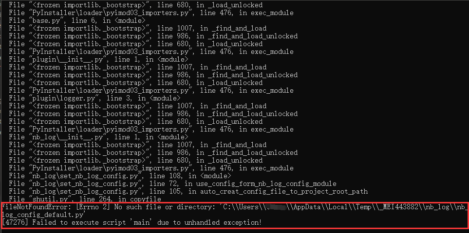

# 9 nb_log常见疑问解答

## 9.1 怎么把普通debug info日志写入文件a，把错误级别日志写到文件b？

```
文中发福讲了日志 logging.getLogger() 或者 nb_log.get_logger() 的第一个入参的含义，说了几百遍，有的人还是不懂入参name的作用是什么，
一直不去了解 name的作用，简直是悲剧。

使用不同命名空间的日志，不同的logger对象就可以表现不同的行为了，就可以写入不同的文件了。
```

```python
from  nb_log import get_logger


logger_foo = get_logger('foo',log_filename='foo.log')

logger_bar = get_logger('bar',log_filename='bar.log')


logger_foo.debug('这句话将会写入foo.log文件')

logger_bar.debug('这句话将会写入bar.log文件')
```

生成的日志如图，你想吧日志写入到什么文件，就使用什么命名空间的logger对象不就好了。


## 9.2 非要使用同一个命名空间的日志，想把错误日志写到错误文件，普通日志写到普通文件。

例如对 foo 命名空间的日志，你想把错误的同时写到foo.log，正常的日志只打印到控制台。

这就需要学习1.8.1 和 1.8.2 中来构建日志logger对象了。因为你又想使用简洁又想花样多，只能使用原始的方式一步步来构建logger对象了。
因为你这样的说法，会造成封装的get_logger方法，入参表示很难，所以nb_log不直接支持 同一个命名空间，不同级别的日志记录到不同的地方。


```python
import logging
from nb_log.handlers import ConcurrentRotatingFileHandler,ColorHandler
from nb_log.nb_log_config_default import FORMATTER_DICT

logger = logging.getLogger('foo')

logger.setLevel(logging.DEBUG)

ch = ColorHandler()
ch.setLevel(logging.INFO)
ch.setFormatter(FORMATTER_DICT[7])
logger.addHandler(ch)

fh = ConcurrentRotatingFileHandler('foo.log')
fh.setLevel(logging.ERROR)
fh.setFormatter(FORMATTER_DICT[11])
logger.addHandler(fh)


logger.debug('debug debug')
logger.info('info info')
logger.warning('warning warning')
logger.error('error error ')
logger.critical('critical critical')

```

控制台截图：


文件日志截图：


使用代码多个步骤的方式来构建 logger非常的灵活，可以随心所欲构建你想要的logger对象。
不仅可以error以上级别写入文件，还可以文件日志和控制台日志使用不同的日志模板。
要想定制自由程度高，就写法步骤要使用原生方式一步步构建logger。

### 9.2.b 特别说明9.2代码的 logger.setLevel() 和 handler.setLevel()的关系

```textmate
有人疑惑我为什么写了 logger.setLevel(logging.DEBUG)，但是控制台缺没有显示debug日志？
因为logger是第一道关，过滤debug以及以上日志。
handler是第二道关，虽然logger是说debug以上就记录，但负责记录到什么地方的是handler，
handler指定了handler.setLevel(logging.INFO),lopgger有求于handler，handler不想记录DEBUG级别日志，
所以最终记录到什么级别是由logger和handler共同决定的，取两者级别的最大值。

例如logger指定DEBUG级别，handler指定INFO级别,最终就会记录info以及以上。
例如logger指定ERROR级别，handler指定DEBUG级别,最终就会记录error以及以上。
```


## 9.3 没有使用pycahrm run运行，直接在linux或cmd运行，生成的nb_log_config.py 位置错误，或者导入不了nb_log_config模块


1.1.c中已经说明了：

项目中任意脚本使用nb_log,第一次运行代码时候，会自动在 sys.path[1] 目录下创建 nb_log_config.py文件并写入默认值。
之后nb_log 会自动 import nb_log_config, 如果import到这个模块了，控制台会提示读取了什么文件作为配置文件。

如果是 cmd或者linux运行不是pycharm，需要 设置 PYTHONPATH为项目根目录，这样就能自动在当前项目根目录下生成或者找到 nb_log_config.py了。

用户可以print(sys.path)  print(sys.path[1]) 来查看 sys.path[1]的值是什么就知道了。

连PYTHONPATH作用是什么都不知道的python小白，一定要看下面文章 。

[pythonpath作用介绍的文章](https://github.com/ydf0509/pythonpathdemo)


说明完全不看文档，到现在还不知道PYTHONPATH的python人员太懒惰low了，文章说了很多次掌握PYTHONPATH的用途和好处了。


## 9.4 pyinstaller 打包后运行报错，no such file nb_log_config_default.py



如上图报错，

是因为导入不了 nb_log_config 模块，因为nb_log包是动态 importlib('nb_log_config')的，所以不能检测到需要打包nb_log_config.py

需要在pyinstaller打包时候生成的spec文件中去定义 hiddenimports 的值， hiddenimports=['nb_log_config'] ，
这样就会打包包括nb_log_config.py了，不会去自动新建配置文件了。


pyinstaller 使用spec文件来打包exe。  pyinstaller xxxx.spec 就可以了。

百度吧，连pyinstaller的spec文件的意义是什么都不知道就非要去打包，要先学习pystaller用法。


### 9.4.2 打包报错 no such file nb_log_config_default.py，解决方式2

只要在你的代码中写上 import nb_log_config ，那么打包就会自动包括了，这样就不需要在spec文件中去定义 hiddenimports 的值了。

<div> </div>